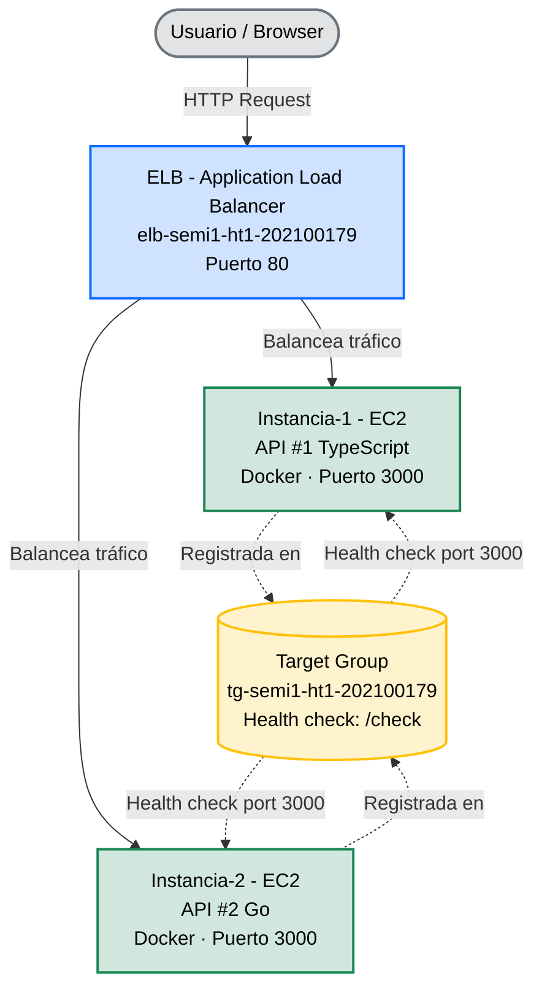

# Hoja de Trabajo #1 — Load Balancer
**Curso:** Seminario de Sistemas 1  
**Estudiante:** Eliezer Guevara — 202100179  
**Fecha:** 04 de marzo de 2026

---

## Objetivo

Implementar y desplegar dos APIs web en instancias EC2 independientes y configurar un Application Load Balancer (ELB) que distribuya el tráfico entre ellas, aplicando conceptos de alta disponibilidad y tolerancia a fallos en AWS.

---

## Arquitectura



---

## Parte 1 — Desarrollo de las APIs

### API #1 — TypeScript (Node.js + Express)

**Estructura de archivos:**
```
api1/
├── src/
│   └── index.ts
├── package.json
├── tsconfig.json
└── Dockerfile
```

**src/index.ts**
```typescript
import express, { Request, Response } from 'express';

const app = express();
const PORT = 3000;

app.get('/check', (_req: Request, res: Response) => {
  res.sendStatus(200);
});

app.get('/', (_req: Request, res: Response) => {
  res.json({
    Instancia: 'Instancia #1 - API #1',
    Curso: 'Seminario de Sistemas 1',
    Estudiante: 'Eliezer Guevara - 202100179',
  });
});

app.listen(PORT, () => {
  console.log(`API #1 (TypeScript) corriendo en puerto ${PORT}`);
});
```

**package.json**
```json
{
  "name": "api1",
  "version": "1.0.0",
  "scripts": {
    "build": "tsc",
    "start": "node dist/index.js",
    "dev": "ts-node src/index.ts"
  },
  "dependencies": {
    "express": "^4.18.0"
  },
  "devDependencies": {
    "@types/express": "^4.17.21",
    "@types/node": "^20.0.0",
    "typescript": "^5.4.0",
    "ts-node": "^10.9.0"
  }
}
```

**tsconfig.json**
```json
{
  "compilerOptions": {
    "target": "ES2020",
    "module": "commonjs",
    "rootDir": "src",
    "outDir": "dist",
    "strict": true,
    "esModuleInterop": true,
    "skipLibCheck": true
  },
  "include": ["src"]
}
```

**Dockerfile**
```dockerfile
# Stage 1: build
FROM node:20-alpine AS builder
WORKDIR /app
COPY package.json .
RUN npm install
COPY tsconfig.json .
COPY src/ src/
RUN npm run build

# Stage 2: runtime
FROM node:20-alpine
WORKDIR /app
COPY --from=builder /app/dist dist/
COPY package.json .
RUN npm install --omit=dev
EXPOSE 3000
CMD ["node", "dist/index.js"]
```

---

### API #2 — Go

**Estructura de archivos:**
```
api2/
├── main.go
└── Dockerfile
```

**main.go**
```go
package main

import (
    "encoding/json"
    "fmt"
    "net/http"
)

type Response struct {
    Instancia  string `json:"Instancia"`
    Curso      string `json:"Curso"`
    Estudiante string `json:"Estudiante"`
}

func checkHandler(w http.ResponseWriter, r *http.Request) {
    w.WriteHeader(http.StatusOK)
}

func rootHandler(w http.ResponseWriter, r *http.Request) {
    w.Header().Set("Content-Type", "application/json")
    json.NewEncoder(w).Encode(Response{
        Instancia:  "Instancia #2 - API #2",
        Curso:      "Seminario de Sistemas 1",
        Estudiante: "Eliezer Guevara - 202100179",
    })
}

func main() {
    http.HandleFunc("/check", checkHandler)
    http.HandleFunc("/", rootHandler)

    fmt.Println("API #2 (Go) corriendo en puerto 3000")
    http.ListenAndServe(":3000", nil)
}
```

**Dockerfile**
```dockerfile
# Stage 1: build
FROM golang:1.22-alpine AS builder
WORKDIR /app
COPY main.go .
RUN go mod init api2 && go build -o api2 .

# Stage 2: runtime
FROM alpine:latest
WORKDIR /app
COPY --from=builder /app/api2 .
EXPOSE 3000
CMD ["./api2"]
```

---

## Parte 2 — Comandos Docker

### Verificación local

```bash
# Construir y correr API #1
cd api1
docker build -t api1 .
docker run -p 3000:3000 api1

# Construir y correr API #2 (puerto 3001 para no colisionar)
cd api2
docker build -t api2 .
docker run -p 3001:3000 api2

# Verificar endpoints
curl http://localhost:3000/           # Respuesta JSON API #1
curl -i http://localhost:3000/check   # HTTP 200 OK
curl http://localhost:3001/           # Respuesta JSON API #2
curl -i http://localhost:3001/check   # HTTP 200 OK
```

### Despliegue en EC2 (via User Data)

```bash
# Instalar dependencias
yum update -y
yum install -y docker git
systemctl start docker
systemctl enable docker

# Clonar repositorio y construir imagen
git clone https://github.com/<usuario>/<repo>.git /app

# En Instancia-1 (API #1)
cd /app/api1
docker build -t api1 .
docker run -d -p 3000:3000 --restart always --name api1 api1

# En Instancia-2 (API #2)
cd /app/api2
docker build -t api2 .
docker run -d -p 3000:3000 --restart always --name api2 api2
```

> El flag `--restart always` garantiza que el contenedor se reinicie automáticamente si la instancia se reinicia.

---

## Parte 3 — Configuración en AWS

### 3.1 Security Group para EC2: `sg-ht1-ec2`

| Campo | Valor |
|---|---|
| Nombre | `sg-ht1-ec2` |
| VPC | Default VPC |

**Inbound rules:**

| Tipo | Puerto | Origen | Propósito |
|---|---|---|---|
| SSH | 22 | My IP | Acceso SSH del desarrollador |
| Custom TCP | 3000 | `sg-ht1-elb` | Tráfico del ELB hacia las APIs |

---

### 3.2 Security Group para ELB: `sg-ht1-elb`

| Campo | Valor |
|---|---|
| Nombre | `sg-ht1-elb` |
| VPC | Default VPC |

**Inbound rules:**

| Tipo | Puerto | Origen | Propósito |
|---|---|---|---|
| HTTP | 80 | 0.0.0.0/0 | Tráfico público hacia el ELB |

---

### 3.3 Instancias EC2

| Campo | Instancia-1 | Instancia-2 |
|---|---|---|
| Nombre | `Instancia-1` | `Instancia-2` |
| AMI | Amazon Linux 2023 | Amazon Linux 2023 |
| Tipo | t2.micro | t2.micro |
| Security Group | `sg-ht1-ec2` | `sg-ht1-ec2` |
| Availability Zone | us-east-2c | us-east-2c |
| API desplegada | API #1 (TypeScript) | API #2 (Go) |
| Puerto | 3000 | 3000 |

El código se despliega automáticamente al lanzar la instancia mediante el script de **User Data**.

---

### 3.4 Target Group: `tg-semi1-ht1-202100179`

| Campo | Valor |
|---|---|
| Nombre | `tg-semi1-ht1-202100179` |
| Target type | Instances |
| Protocol | HTTP |
| Port | 3000 |
| VPC | Default VPC |
| Health check protocol | HTTP |
| Health check path | `/check` |

**Instancias registradas:**

| Instancia | Puerto | Health Status |
|---|---|---|
| Instancia-1 | 3000 | Healthy |
| Instancia-2 | 3000 | Healthy |

---

### 3.5 Application Load Balancer: `elb-semi1-ht1-202100179`

| Campo | Valor |
|---|---|
| Nombre | `elb-semi1-ht1-202100179` |
| Tipo | Application Load Balancer |
| Scheme | Internet-facing |
| IP address type | IPv4 |
| VPC | Default VPC |
| Availability Zones | us-east-2a, us-east-2b, us-east-2c |
| Security Group | `sg-ht1-elb` |

**Listener:**

| Puerto | Protocolo | Acción |
|---|---|---|
| 80 | HTTP | Forward → `tg-semi1-ht1-202100179` |

**DNS Name:**
```
elb-semi1-ht1-202100179-1832145549.us-east-2.elb.amazonaws.com
```

---

## Parte 4 — Verificación

```bash
# El ELB balancea el tráfico alternando entre API #1 y API #2
curl http://elb-semi1-ht1-202100179-1832145549.us-east-2.elb.amazonaws.com/
# {"Instancia":"Instancia #1 - API #1","Curso":"Seminario de Sistemas 1","Estudiante":"Eliezer Guevara - 202100179"}

curl http://elb-semi1-ht1-202100179-1832145549.us-east-2.elb.amazonaws.com/
# {"Instancia":"Instancia #2 - API #2","Curso":"Seminario de Sistemas 1","Estudiante":"Eliezer Guevara - 202100179"}

curl -i http://elb-semi1-ht1-202100179-1832145549.us-east-2.elb.amazonaws.com/check
# HTTP/1.1 200 OK
```

---

## Problemas encontrados y soluciones

### 1. Instancias en estado "Unused" en el Target Group
**Causa:** Las instancias estaban en la AZ `us-east-2c` pero el ELB solo tenía habilitadas `us-east-2a` y `us-east-2b`.  
**Solución:** Agregar `us-east-2c` al ELB desde Network mapping → Edit subnets.

### 2. Security Group bloqueaba el health check
**Causa:** El Security Group de las EC2 no permitía tráfico entrante desde el ELB en el puerto 3000.  
**Solución:** Agregar una inbound rule en `sg-ht1-ec2` que permita el puerto 3000 con origen `sg-ht1-elb` (referencia por Security Group, no por IP).

### 3. `curl /check` no mostraba respuesta
**Causa:** El endpoint `/check` retorna HTTP 200 sin body, por lo que `curl` no imprime nada.  
**Solución:** Usar `curl -i` para visualizar los headers de respuesta, donde se confirma el `HTTP/1.1 200 OK`.
